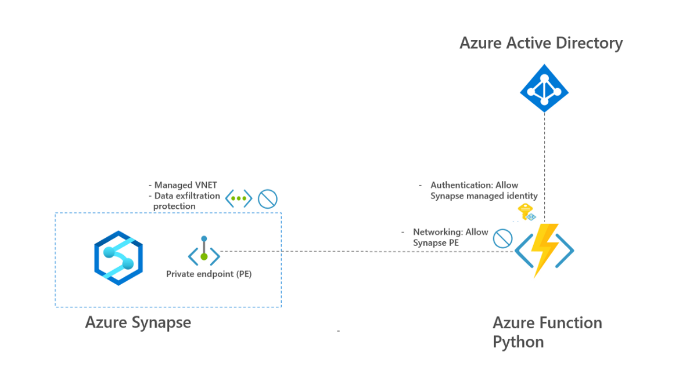

# securely-connect-synapse-azure-function

Git repo to connect Synapse pipeline to Azure Functions using following security:

- Synapse data exfiltration prevention to prevent insider attacks
- Private endpoints to limit exposure of Azure Function to internal only
- Azure AD authentication using identity to access Azure Function
- Whitelisting Synapse Managed Identity as only allowed identity to access Azure Function

See also overview below:



Steps to take:

1. Substitute variables in ```Scripts/0_variables.ps1``` to deploy ADF and deltalake.
2. Run all scripts in ```Scripts``` sequentually
3. Log into Synapse workspace and run Synapse pipeline

See also screenshot of successfull deployment and successfull testrun of Synapse pipeline.

